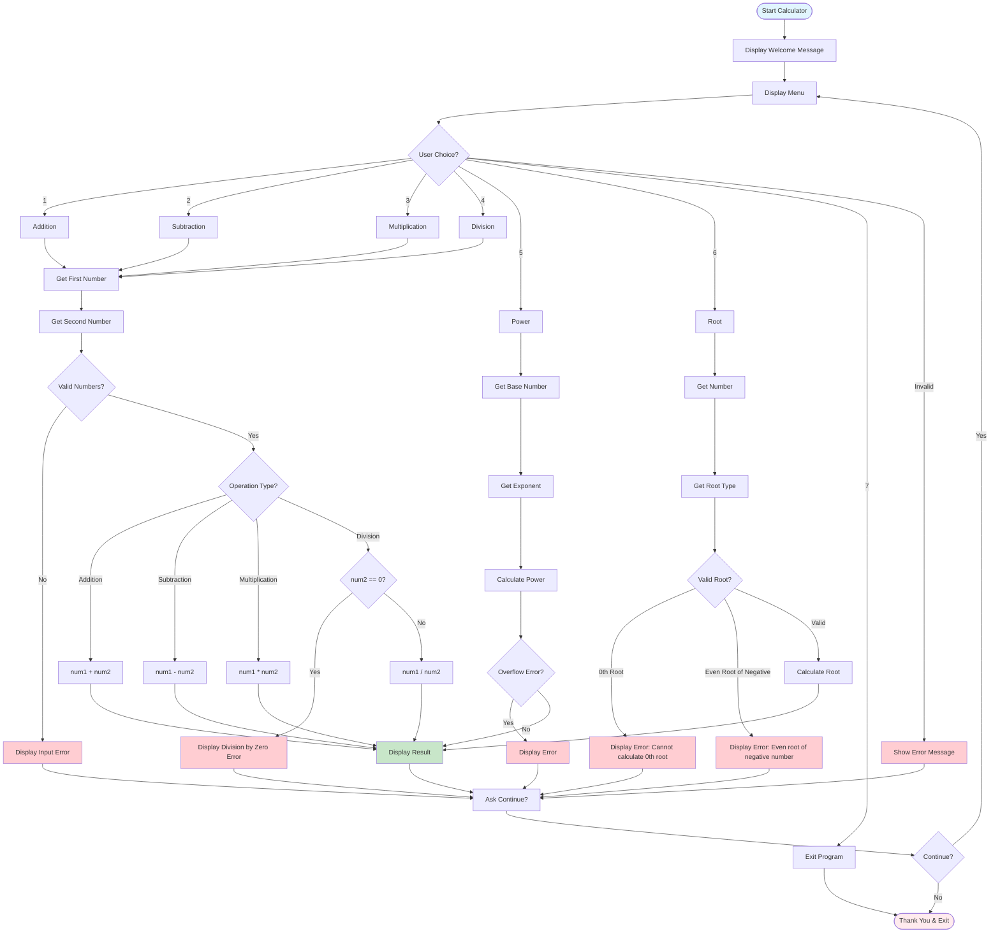

# Simple Python Calculators

This repository contains two simple Python calculator implementations:

1. **`calculator.py`:** An interactive calculator with a user-friendly menu interface.
2. **`simple_calc.py`:** A modular calculator that can be imported and used in other Python scripts.

## 1. Interactive Calculator (`calculator.py`)

### Description
A command-line calculator that guides the user through various arithmetic operations using a menu-driven interface.

### Features
- **Addition (+)**
- **Subtraction (-)**
- **Multiplication (*)**
- **Division (/)**: Includes protection against division by zero.
- **Power (**)**: Raises a number to any power (including negative and fractional exponents)
- **Root (nth root)**: Calculates any root of a number (square root, cube root, etc.)
- **Continuous operation** until the user decides to exit.

### How It Works
- **Menu Driven:** Presents users with a menu of options to perform arithmetic operations or to exit the program.
- **User Input Handling:** Prompts the user to input numbers and select an operation, validating the inputs. For power operations, prompts for base and exponent. For root operations, prompts for the number and the root type.
- **Operations Execution:** Performs the selected arithmetic operation and displays the result.
- **Error Handling:** Handles special cases like division by zero, even roots of negative numbers, and overflow errors.

### Calculator Flow Diagram



### Usage
Run the script using Python:
```bash
python3 calculator.py
```

## 2. Calculator Module (`simple_calc.py`)

### Description
A flexible module that can be easily imported into other Python scripts, providing basic arithmetic operations.

### Features
- **Arithmetic Methods:**
  - `add(x, y)`: Returns the sum of `x` and `y`.
  - `subtract(x, y)`: Returns the difference where `y` is subtracted from `x`.
  - `multiply(x, y)`: Returns the product of `x` and `y`.
  - `divide(x, y)`: Returns the division of `x` by `y`, raising an exception if `y` is zero.
- **Expression Evaluation:**
  - `calculate(expression)`: Evaluates a simple arithmetic expression passed as a string.

### How It Works
- **Class-Based Design:** The `Calculator` class encapsulates arithmetic operations as static methods.
- **Standalone Demo:** When executed, the module demonstrates its functionality via hardcoded examples.
- **Module Importing:** Allows other scripts or applications to import and utilize its arithmetic functions.

### Usage as a Standalone Script
Run the script to see demonstrations of the calculator's capabilities:
```bash
python3 simple_calc.py
```

### Usage as a Module
Import the module's functions or the `Calculator` class:
```python
from simple_calc import Calculator, add, subtract, multiply, divide

result = add(5, 3)
expression_result = Calculator.calculate("(10 + 5) * 2")
```

## Error Handling
- **Invalid Inputs:** Protects against invalid inputs and division by zero, providing relevant error messages.
- **Power Operations:** Handles overflow errors for very large results.
- **Root Operations:** Prevents calculation of even roots of negative numbers and 0th roots.
- **Mathematical Edge Cases:** Handles negative exponents, fractional powers, and complex mathematical scenarios.

---

These calculators demonstrate simple arithmetic operations while handling errors gracefully. Feel free to extend their functionality or integrate them into larger projects!
