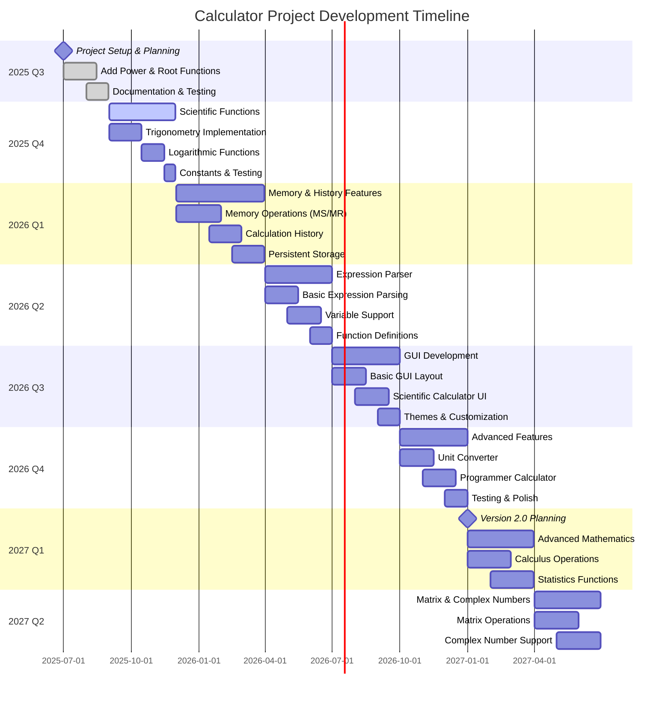

# Project Roadmap

This document outlines the planned features and improvements for the Python Calculator project. The roadmap is organized by versions and priority levels.

## 🎯 Vision

To create a comprehensive, user-friendly calculator ecosystem that serves both beginners learning Python and developers needing reliable calculation tools.

---

## 📋 Current Status (v1.1.0)
- ✅ Basic arithmetic operations (+, -, *, /)
- ✅ Power operations (**)
- ✅ Root operations (nth root)
- ✅ Interactive menu-driven interface
- ✅ Modular calculator for imports
- ✅ Comprehensive error handling
- ✅ Documentation and changelog

---

## 📊 Development Timeline

---

## 🚀 Upcoming Releases

### Version 1.2.0 - Scientific Functions
**Target: Q1 2025**

#### New Features
- **Trigonometric Functions**
  - `sin()`, `cos()`, `tan()`
  - `asin()`, `acos()`, `atan()`
  - Degree/Radian mode toggle
- **Logarithmic Functions**
  - Natural logarithm (`ln`)
  - Base-10 logarithm (`log`)
  - Custom base logarithm (`log_base`)
- **Constants**
  - π (pi)
  - e (Euler's number)
  - φ (Golden ratio)

#### Improvements
- Add scientific mode to interactive calculator
- Enhanced `simple_calc.py` with scientific methods
- Unit tests for all mathematical functions

---

### Version 1.3.0 - Memory & History
**Target: Q2 2025**

#### New Features
- **Memory Functions**
  - Memory store (MS)
  - Memory recall (MR)
  - Memory clear (MC)
  - Memory add/subtract (M+/M-)
- **Calculation History**
  - Store last 10 calculations
  - History navigation (up/down arrows)
  - Clear history option
  - Export history to file

#### Improvements
- Persistent memory across sessions
- History search functionality
- Improved user interface with history display

---

### Version 1.4.0 - Expression Parser
**Target: Q3 2025**

#### New Features
- **Advanced Expression Parsing**
  - Support for complex expressions: `(5 + 3) * sin(π/4)`
  - Variable support: `x = 5; y = x^2 + 3`
  - Function definitions: `f(x) = x^2 + 2*x + 1`
- **Improved Calculator Interface**
  - Expression input mode
  - Syntax highlighting for expressions
  - Auto-completion for functions

#### Technical Improvements
- Custom expression parser (replace `eval()`)
- Better error messages with expression highlighting
- Support for nested functions and operators

---

### Version 1.5.0 - GUI Interface
**Target: Q4 2025**

#### New Features
- **Graphical User Interface**
  - Modern GUI using Tkinter or PyQt
  - Button-based calculator layout
  - Scientific calculator view
  - Programmer calculator mode
- **Multiple Calculator Types**
  - Basic calculator
  - Scientific calculator
  - Programmer calculator (binary, hex, octal)
  - Unit converter

#### Technical Features
- Cross-platform GUI compatibility
- Keyboard shortcuts
- Copy/paste functionality
- Customizable themes

---

## 🔮 Future Vision (v2.0.0+)

### Version 2.0.0 - Advanced Mathematics
**Target: 2026**

#### Planned Features
- **Calculus Operations**
  - Derivative calculator
  - Integral calculator (numerical)
  - Limit calculator
- **Statistics Functions**
  - Mean, median, mode
  - Standard deviation, variance
  - Probability distributions
- **Matrix Operations**
  - Matrix addition, multiplication
  - Determinant calculation
  - Matrix inversion
- **Complex Numbers**
  - Complex arithmetic
  - Polar/rectangular conversion
  - Complex function support

### Version 2.1.0 - Graphing Calculator
**Target: 2026**

#### Planned Features
- **Function Plotting**
  - 2D function graphs
  - Multiple function overlay
  - Zoom and pan functionality
- **Data Visualization**
  - Scatter plots
  - Bar charts
  - Statistical plots

### Version 3.0.0 - Web Application
**Target: 2027**

#### Planned Features
- **Web Interface**
  - Browser-based calculator
  - Real-time calculations
  - Shareable calculation sessions
- **Cloud Features**
  - Save calculations to cloud
  - Collaborative calculations
  - Mobile-responsive design

---

## 🛠️ Technical Improvements

### Code Quality & Architecture
- [ ] Implement comprehensive unit tests (pytest)
- [ ] Add type hints throughout codebase
- [ ] Implement logging system
- [ ] Code coverage reporting
- [ ] Performance optimization
- [ ] Documentation improvements (Sphinx)

### DevOps & CI/CD
- [ ] GitHub Actions for automated testing
- [ ] Automated code formatting (Black, isort)
- [ ] Linting with flake8/pylint
- [ ] Security scanning
- [ ] Automated releases
- [ ] Docker containerization

### Accessibility & Internationalization
- [ ] Multi-language support
- [ ] Accessibility features for GUI
- [ ] High contrast themes
- [ ] Voice input/output support
- [ ] Keyboard-only navigation

---

## 🎯 Priority Matrix

### High Priority (Next 2 versions)
- Scientific functions (trigonometry, logarithms)
- Memory and history features
- Comprehensive testing suite
- Better error handling and user feedback

### Medium Priority (Versions 1.4-1.5)
- Expression parser
- GUI interface
- Unit converter
- Performance optimizations

### Low Priority (Future versions)
- Advanced mathematics (calculus, statistics)
- Web application
- Mobile app
- Collaborative features

---

## 🤝 Contributing

We welcome contributions! Here are areas where help is needed:

### For Beginners
- Documentation improvements
- Bug reporting and testing
- Translation to other languages
- Simple feature implementations

### For Experienced Developers
- Advanced mathematical functions
- GUI development
- Web application framework
- Performance optimization
- Architecture improvements

### For Mathematicians
- Mathematical accuracy verification
- Algorithm optimization
- Advanced function implementations
- Edge case identification

---

## 📊 Success Metrics

### Version 1.2.0 Goals
- [ ] 95% test coverage
- [ ] Support for 15+ mathematical functions
- [ ] Zero critical bugs in production
- [ ] Documentation completeness score >90%

### Long-term Goals
- [ ] 1000+ GitHub stars
- [ ] Community contributions from 10+ developers
- [ ] Educational adoption in programming courses
- [ ] Cross-platform compatibility (Windows, macOS, Linux)

---

## 📝 Notes

This roadmap is a living document and will be updated based on:
- Community feedback and requests
- Technical feasibility assessments
- Development resources and time constraints
- Industry trends and best practices

**Last Updated:** August 3, 2025  
**Next Review:** September 1, 2025

---

## 📞 Feedback

Have ideas for the roadmap? Please:
- Open an issue on GitHub
- Start a discussion in the repository
- Contact the maintainers directly

Your input helps shape the future of this project! 🚀
